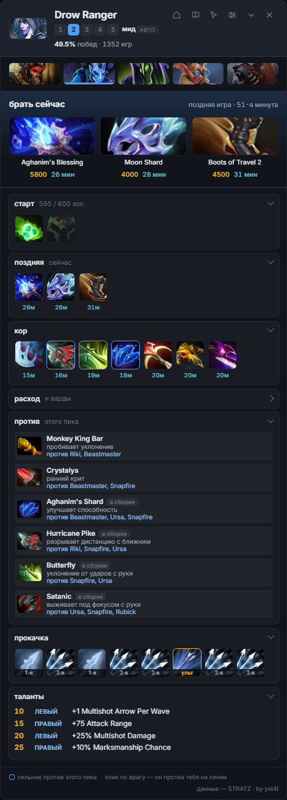
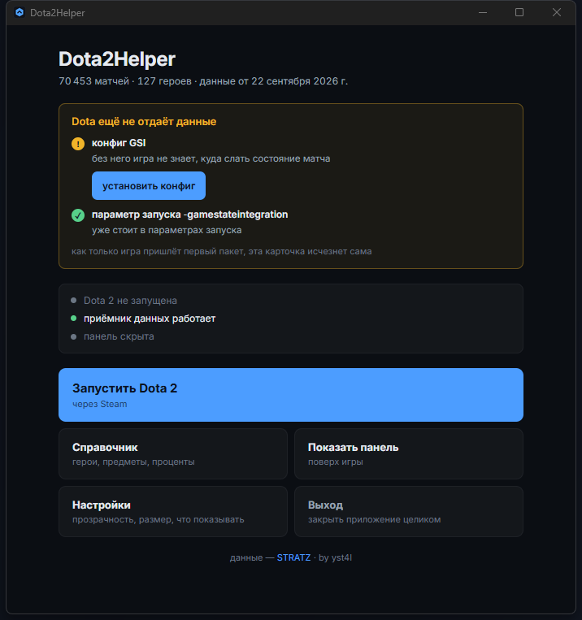
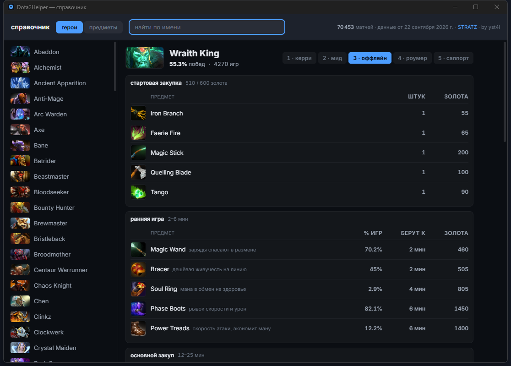

<div align="center">

# Dota2Helper

**Подсказка по сборке прямо в игре — не чьё-то мнение, а 70 тысяч разобранных матчей.**

Панель поверх Доты показывает, что брать следующим на твоём герое, к какой минуте это обычно собирают и что из этого меняется из-за вражеского пика. Появляется сама на драфте, прячется после матча.



<sub>Патч 7.41f · 70 453 матча · Windows · без чтения памяти игры</sub>

</div>

---

## Что показывает

**Что брать сейчас.** Не весь билд списком, а два-три предмета под текущую минуту, с ценой и тем, к какому времени их обычно успевают.

**Сборку по фазам — как ленту времени.** Начальный закуп, ранняя, основной закуп, поздняя. Предмет стоит в той фазе, к которой его *обычно* собирают, и внутри фазы ряд читается слева направо как порядок покупок. Под каждой иконкой — минута, а не абстрактный процент.

**Против кого и зачем.** Вражеский пик меняет сборку, и панель говорит, как именно: «Black King Bar — не даёт застанить и сжечь магией, против Nyx Assassin и Ancient Apparition». Первая строка — знание об игре, вторая посчитана по матчам, где эти герои реально стояли против тебя.

**Порядок прокачки и таланты.** С номерами способностей, как они стоят у героя, и со стороной таланта в дереве — «левый на 15-м» находится сразу, даже если интерфейс игры русский, а названия у нас английские.

**Стартовую закупку под твоё золото.** Не «типичный набор», а самый частый целый набор, который влезает в то золото, что у тебя на руках прямо сейчас.

## Как это считается

Обычный совет в гайде — это чьё-то мнение. Здесь за каждой цифрой лежат разобранные матчи, и правила счёта выбраны так, чтобы не врать:

- **Фаза предмета — по медиане его тайминга,** а не по тому, в какое окно попала отдельная покупка. Иначе один и тот же предмет двоится между «ранней» и «кором» из-за тех, кто успел к 9:50.
- **Матчи старого патча не выбрасываются, а весят меньше.** Выбросить — значит остаться без данных в первые недели после патча. Вес падает вдвое за каждый патч назад, а прошлая большая версия весит вдесятеро меньше нынешней.
- **Проценты считаются по весу, а «N игр» — по штукам.** Подпись должна означать ровно то, что написано.
- **Винрейт дорогих предметов обманчив** — их успевает купить тот, кто и так выигрывает. Поэтому порядок задаёт популярность, а винрейт идёт справочно.
- **Полуфабрикаты сворачиваются в собранный предмет.** В списке должен стоять Sange and Yasha, а не Yasha с Ogre Axe.

## Скриншоты

<table>
<tr>
<td width="50%"><br><sub><b>Главное окно.</b> Само проверяет, готова ли Дота отдавать данные, и ставит конфиг кнопкой.</sub></td>
<td width="50%"><br><sub><b>Справочник.</b> Любой герой и любая позиция вне матча: что, когда и в скольких играх.</sub></td>
</tr>
</table>

## Установка

Готовый установщик появится в [Releases](../../releases) — пока собирается.

<details>
<summary>Запустить из исходников</summary>

Нужен Python 3.12 и Windows.

```
py -3.12 -m venv .venv
.venv\Scripts\pip install -r requirements.txt
start.bat
```

Данные (`snapshot.json.gz`) и иконки в репозиторий не входят: первое — готовый агрегат, второе качается из открытого CDN Valve. Как собрать их самому — ниже, в разделе про свои данные.

</details>

### Настройка Доты

Игра отдаёт состояние матча сама — этот механизм Valve сделала как раз для таких программ. Нужны две вещи, и приложение проверяет обе само, а первую умеет поставить кнопкой:

1. конфиг в папке игры — кнопка **«установить конфиг»** в главном окне;
2. параметр запуска `-gamestateintegration` — Steam → библиотека → Dota 2 → правая кнопка → Свойства → Параметры запуска.

Пока чего-то не хватает, в главном окне висит карточка с тем, что именно не так. Как только игра пришлёт первый пакет, карточка исчезает.

### Про безопасность

Dota2Helper **не читает память игры, не внедряется в процесс и не автоматизирует действия**. Всё, что он знает о матче, игра присылает сама через Game State Integration — официальный механизм Valve. Единственное, что программа пишет в папку игры, — тот самый конфиг GSI, который для этого и предназначен.

## Управление

Панель ведёт себя как обычное окно: её можно двигать мышью, сворачивать, растягивать за край, закрывать.

| | |
|---|---|
| `Ctrl` + `Alt` + `D` | компактный режим: только «что брать дальше» |
| `Ctrl` + `Alt` + `F` | пропускать клики в игру (панель перестаёт ловить мышь) |

Когда клики уходят в игру, над панелью появляется отдельная кнопка возврата: выключатель режима не может жить внутри того, что он выключает.

В настройках — прозрачность, размер, показывать ли панель только в матче и девять галочек «что показывать»: лишние блоки можно просто убрать.

## Как устроено

```
Dota 2  ──GSI──▶  приёмник  ──▶  трекер матча  ──▶  движок  ──▶  панель
                (localhost)      кто за кого        snapshot     (Chromium
                                 и что куплено      в памяти      внутри Qt)
```

Вся статистика лежит в одном файле `snapshot.json.gz` — **1.4 МБ**, который целиком держится в памяти. Во время матча программа не ходит ни в сеть, ни в базу: совет считается за миллисекунду.

База сырых матчей (около 2 ГБ) — серверная, к игроку она не едет никогда. Её место — на машине, где собираются данные.

<details>
<summary>Собрать данные самому</summary>

Нужны ключи [STRATZ](https://stratz.com/api) и [Steam](https://steamcommunity.com/dev/apikey) — скопируй `.env.example` в `.env` и впиши их.

```python
from services.collector import collect, save_constants, save_hero_layout
from services.icons import download_all
from services.guides_pass import build_all
from services.precompute import build_matchups
from services.snapshot import export_snapshot

save_constants()        # герои, предметы, способности
save_hero_layout()      # слоты способностей и дерево талантов
download_all()          # иконки из CDN Valve
collect(target=10000)   # матчи
build_all()             # гайды: герой + позиция
build_matchups()        # поправки под вражеский пик
export_snapshot()       # то единственное, что нужно приложению
```

Всё считается одним проходом по матчам, а не запросом на каждую связку: разница — минуты против часов.

</details>

## Лицензия

[MIT](LICENSE) — делай что хочешь, только оставь копирайт.

## Благодарности

Данные — [STRATZ](https://stratz.com/) и [OpenDota](https://www.opendota.com/). Иконки, список героев и даты патчей — из открытых источников Valve. Dota 2 — товарный знак Valve Corporation; проект с ней никак не связан.
